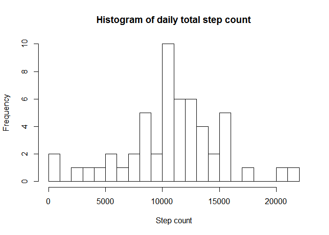
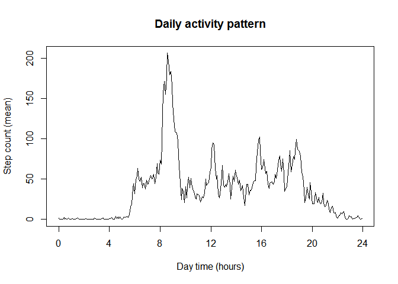
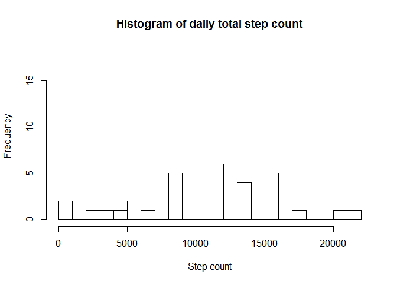
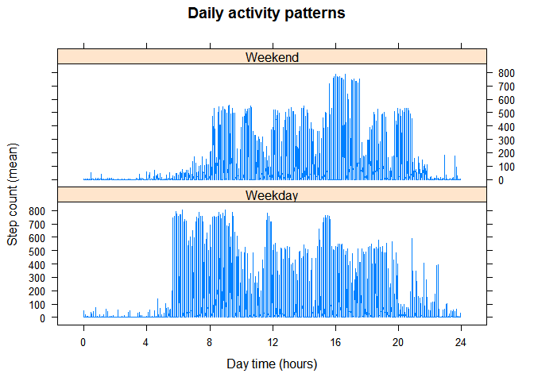

# Reproducible Research: Peer Assessment 1
Yannick Rousseau  
2016/05/09  

## Loading and preprocessing the data


```r
# Set the option to prevent scientific notation.
options(scipen=999)

# Read text file.
fn          <- "activity.csv"
dat         <- read.csv(fn, stringsAsFactors=FALSE)

# Put the data into a data frame and pad the interval values with zeros.
df          <- data.frame(dat)
df$interval <- sprintf("%04d", df$interval)
```

## What is mean total number of steps taken per day?

```r
# Aggregate the number of steps per day (date) while summing up the values. 
spd         <- aggregate(steps ~ date, data=df, FUN="sum")

# Calculate the mean and median daily step count.
spdMean     <- as.numeric(mean(spd$steps))
spdMedian   <- as.numeric(median(spd$steps))

# Create the histogram.
hist(x=spd$steps, breaks=16, xlab="Step count", ylab="Frequency",
    main="Histogram of daily total step count")
```

<!-- -->

The mean daily number of steps is 10766.19
and the median is 10765.00.

## What is the average daily activity pattern?

```r
# Create a new (complete) data frame without the missing values.
dfWONA      <- df[complete.cases(df),]

# Create a decimal time column.
dfWONA$time <- as.numeric(substr(dfWONA$interval, 1, 2)) +
               as.numeric(substr(dfWONA$interval, 3, 4))/60.0

# Group data by 5-min intervals (spi = steps per interval).
spi         <- aggregate(steps ~ time + interval, data=dfWONA, FUN="mean")

# Create plot.
plot(x=spi$time, y=spi$steps, type="l", xaxt="n",
     main="Daily activity pattern",
     xlab="Day time (hours)", ylab="Step count (mean)")
axis(1, at=seq(0, 24, by=4))
```

<!-- -->

```r
# Calculate the time interval with the maximum step count.
intMax      <- spi[which.max(spi$steps), ]$interval
intMaxStr   <- paste(substr(intMax, 1, 2), sep=":", substr(intMax, 3, 4))
```

The 5-minute interval, on average across all the days in the dataset, that
is associated with the maximum step count is 08:35.

## Imputing missing values

```r
# Calculate the number of rows with missing values.
nRowsNA     <- nrow(df[!complete.cases(df),])
```

There are 2304 rows with missing values.


```r
# Fill in the missing values (only found in the column steps).
# This is done by merging with the data frame that contains the 5-minute mean
# values. Unmerge after replacing a NA value by the mean value.
dfWONA <- merge(x=df, y=spi, by="interval", all=TRUE)
dfWONA[is.na(dfWONA$steps.x),]$steps.x <- dfWONA[is.na(dfWONA$steps.x),]$steps.y
dfWONA <- dfWONA[,1:4]
names(dfWONA)[2] <- paste("steps")

# Aggregate the daily step count (per date) while summing up the values. 
spdWONA <- aggregate(steps ~ date, data=dfWONA, FUN="sum")

# Calculate the mean and median daily step count.
spdWONAMean   <- as.numeric(mean(spdWONA$steps))
spdWONAMedian <- as.numeric(median(spdWONA$steps))

# Create the histogram.
hist(x=spdWONA$steps, breaks=16, xlab="Step count", ylab="Frequency",
    main="Histogram of daily total step count")
```

<!-- -->

The mean daily step count is 10766.19
and the median is 10766.19.
The median value differs slightly from the one obtained without imputation.
However, the mean value is the same.
The shape of the histogram is very similar to what it was. However, the category
with the highest frequency increased from 10 to roughly 18.

## Are there differences in activity patterns between weekdays and weekends?

```r
library(lubridate)
```

```
## 
## Attaching package: 'lubridate'
```

```
## The following object is masked from 'package:base':
## 
##     date
```

```r
library(lattice)

# Add a variable to tell whether it is a week day or week end day.
dfWONA$dayType <-
    ifelse(wday(dfWONA$date) %in% seq(2,6,by=1), "Weekday", "Weekend")

# Create panel plot.
xyplot(steps ~ time|dayType, data=dfWONA, type="l", layout=c(1,2),
       scales=list(x=list(at=seq(0, 24, by=4)), y=list(tick.number=10)),
       main="Daily activity patterns",
       xlab="Day time (hours)", ylab="Step count (mean)")
```

<!-- -->
